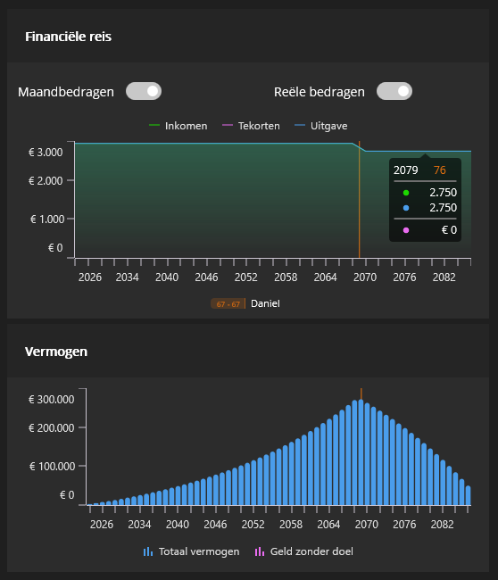
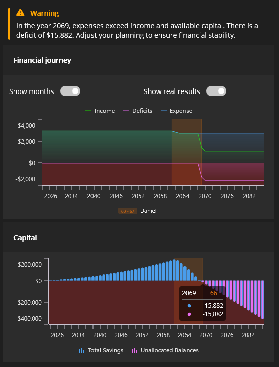
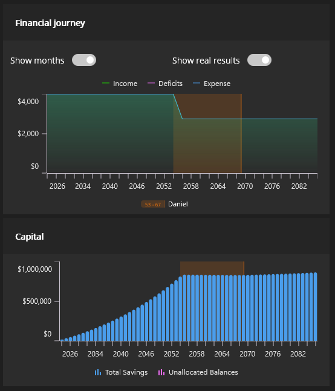

The FIRE movement has gained significant traction among younger generations, offering a roadmap to financial freedom and the possibility of retiring far before traditional retirement age. But what exactly is FIRE, and is it achievable for you?

## What is FIRE?

FIRE stands for **Financial Independence, Retire Early**. This movement originated in the United States and has spread globally. The core idea is straightforward: spend less than you earn, invest the difference wisely, and build enough wealth to live off your investment returns rather than a paycheck.

While the term emphasizes retiring early, many FIRE practitioners focus more on the financial independence aspect. The goal isn't necessarily to stop working entirely, but to gain the freedom to choose how you spend your time.

## What Financial Independence Really Means

Financial independence looks different for everyone. For some, it means never working again. For others, it's about working fewer hours, taking extended breaks, or pursuing passion projects without financial pressure.

For many in the FIRE community, the emphasis is on freedom rather than early retirement. When you're not dependent on a salary, you can:

- Reduce your work hours
- Take sabbaticals to travel or explore new interests
- Pursue hobbies, creative endeavors, or volunteer work
- Make career changes without worrying about income loss

The movement has gained particular popularity among people in their twenties and thirties who are looking to break free from the traditional work-retire cycle.

## The Math: How Much Do You Need?

The FIRE community uses a straightforward formula to calculate your target number: **multiply your annual expenses by 25**.

This calculation is based on the **4% rule**, which suggests that if you withdraw 4% of your portfolio annually, your money should last throughout retirement. The theory is that your investment returns will at least match your withdrawal rate, allowing you to live off your investments indefinitely.

### Example Calculation

| Monthly expenses: | €3,000 |
| ----------------- | ------ |
| Annual expenses: | 12 × €3,000 = €36,000 |
| Target portfolio: | 25 × €36,000 = €900,000 |
| Annual 4% return: | 4% × €900,000 = €36,000 |

**Result:** Your annual investment return equals your annual expenses, meaning you don't need additional income sources.

*Figure 1: Traditional retirement path with sustainable capital throughout*

## Five Steps to Financial Independence

### Step 1: Define Your Goal

What does financial independence mean to you? Do you want to stop working at 45? Take a year off to travel? Work part-time in your fifties? 

Having a clear target makes it easier to create a personalized plan, stay motivated, and track your progress. Consider:

- What age do you want to achieve FIRE?
- What activities would you pursue with your newfound freedom?
- How much income do you need to maintain your desired lifestyle?

### Step 2: Track Your Income and Expenses

Good preparation is essential. Start by understanding your cash flow. Keep a budget or use an app to track every euro that comes in and goes out. Document:

- Fixed costs (rent, utilities, insurance)
- Variable expenses (dining out, entertainment, shopping)
- All income sources

Apps and digital tools can make this process easier, helping you identify where your money goes each month.

### Step 3: Reduce Expenses

Review your spending critically. Ask yourself: where can I cut back?

Potential areas for savings include:

- Canceling or downgrading subscriptions
- Eating out less frequently
- Avoiding impulse purchases
- Reducing utility costs
- Making extra mortgage payments

While individual savings might seem small, they add up significantly over a year. The key is consistent, mindful spending.

### Step 4: Increase Your Income

While FIRE isn't primarily about earning more, additional income accelerates your journey. If you're employed:

- Request a raise based on your performance
- Seek promotions or career advancement
- Start a side business
- Develop passive income streams (like renting out property)

If you're self-employed, consider adjusting your rates. More income, without increasing your spending, means more to invest each month.

### Step 5: Invest Wisely

Saving alone isn't enough in today's economic environment. With low or negative real interest rates and inflation, cash under the mattress loses value over time.

Investing allows your money to grow. Most FIRE followers aim to invest at least 25% of their income, with many targeting higher percentages. The potential for strong returns makes investing attractive, but it comes with risks and costs. You could lose part or all of your investment.

*Figure 2: The risk of early retirement without sufficient capital accumulation*

## How Realistic is FIRE?

The feasibility of FIRE depends heavily on your personal situation. While many people have embraced the movement, there's also significant criticism.

### Criticism 1: Requires Extreme Frugality

To reach FIRE with a moderate income, you may need to live extremely minimally. This could mean:

- Housing far below your means
- Never dining out or socializing
- Skipping vacations
- Cutting nearly all discretionary spending

Some critics argue this contradicts FIRE's promise of freedom and happiness.

### Criticism 2: The 4% Rule May Not Hold

The 4% rule was developed in different economic conditions. Today's environment features:

- Low interest rates
- High stock valuations
- Uncertain inflation

Additionally, governments may increase taxes on wealth and investment returns, making it harder to live off your portfolio, especially with smaller sums.

### Criticism 3: Depends on Your Timeline

Your FIRE timeline dramatically affects feasibility:

- **Traditional FIRE approach**: Save and invest as much as possible, retire as soon as possible
- **Extended timeline**: Planning for FIRE in 30 years gives you more time and requires less monthly saving

Many FIRE practitioners discover that the process itself leads to better financial decisions, resulting in greater happiness regardless of when they achieve financial independence.

*Figure 3: Successful FIRE path with adequate capital for early retirement*

## Is FIRE Right for You?

The FIRE method isn't suitable for everyone. It demands significant lifestyle changes and sustained discipline. You'll need to give up certain comforts and maintain focus over many years.

Before committing, ask yourself:

- Am I willing to make substantial lifestyle adjustments?
- Can I maintain this approach for decades?
- What does financial independence mean specifically for me?

Regardless of whether you pursue full FIRE, examining your spending patterns is worthwhile. Understanding where your money goes and making conscious choices about it improves your financial situation in any case.

Consider customizing the approach:

- Aim to work less rather than stop entirely
- Plan to retire at 50 instead of as soon as possible
- Focus on building flexibility rather than complete financial independence

## Getting Started with Investing

If you're ready to begin investing but lack time or expertise, managed investing services offer a solution. Professional investment experts handle your portfolio according to your risk profile and goals.

Managed investing can start with as little as €50 per month or €1,000 as a one-time investment.

**Important:** While investing can generate strong returns, it carries risks and costs. You could lose part or all of your invested capital.

---

The FIRE movement offers more than just a path to early retirement; it provides a framework for intentional financial living. Whether you fully embrace FIRE or adapt its principles to your circumstances, the core message remains valuable: be mindful of your money, invest wisely, and work toward the freedom to live life on your terms.